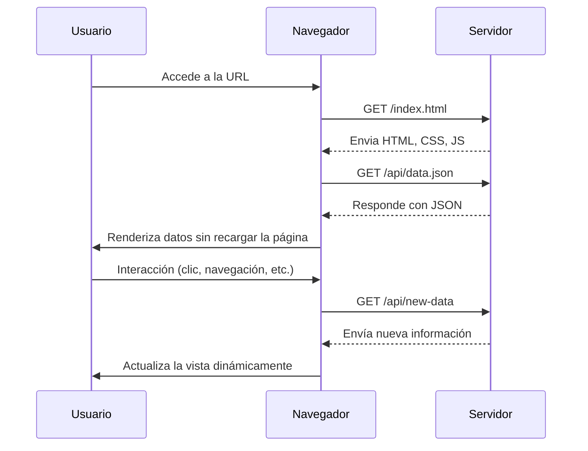

# 🚀 Aplicación Web con SPA (Single Page Application)

## 📌 ¿Cómo funciona una SPA?

Una **Single Page Application (SPA)** es una aplicación web que carga una única página HTML y actualiza dinámicamente el contenido sin necesidad de recargar toda la página.

---

## 🔄 Flujo de funcionamiento

1. **El usuario accede a la aplicación**
   - Se carga una única página con HTML, CSS y JavaScript.
   - Se obtiene contenido dinámicamente mediante **AJAX o Fetch API**.

2. **El usuario navega dentro de la app**
   - No hay recarga completa de página.
   - Solo se actualizan las partes necesarias del DOM, mejorando la fluidez y la experiencia de usuario.

---

## 📡 Diagrama de flujo de una SPA

---

## 🎯 Ventajas de una SPA
✅ Experiencia fluida y rápida 🔥  
✅ Reducción del uso de ancho de banda 📶  
✅ Optimización del rendimiento 💨  
✅ Ideal para aplicaciones modernas y móviles 📱

📌 *Las SPA permiten una experiencia de usuario más fluida y eficiente en comparación con las aplicaciones tradicionales basadas en múltiples páginas.* 🚀